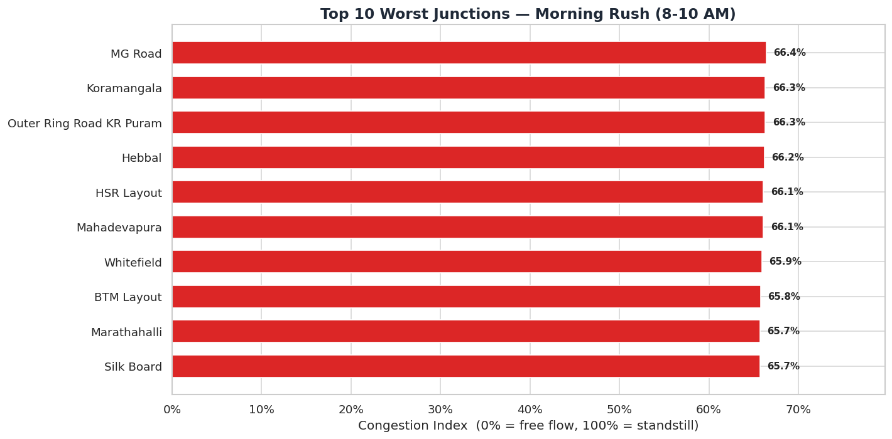
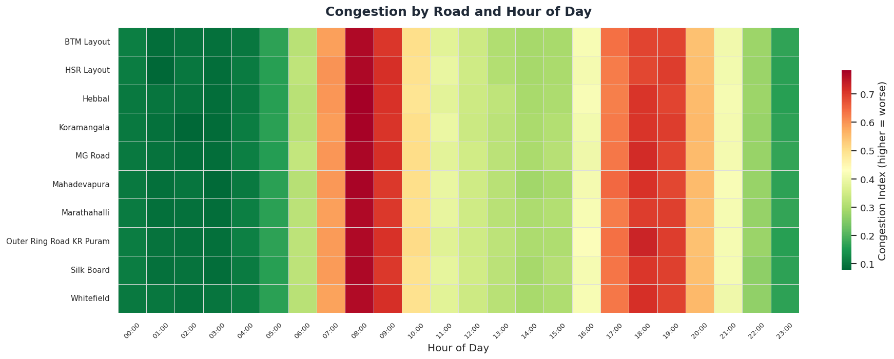
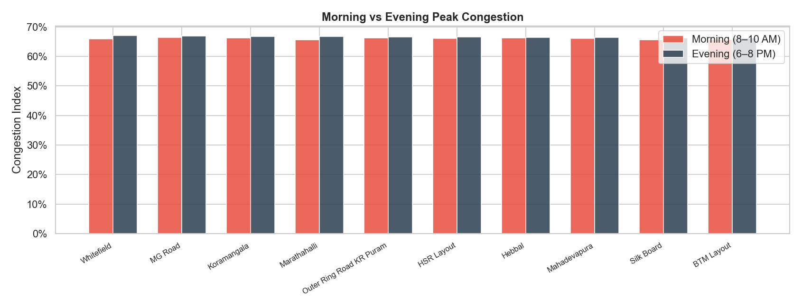
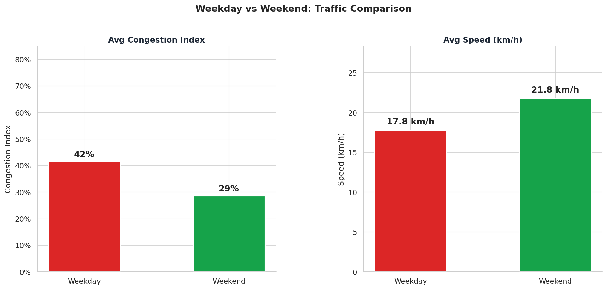
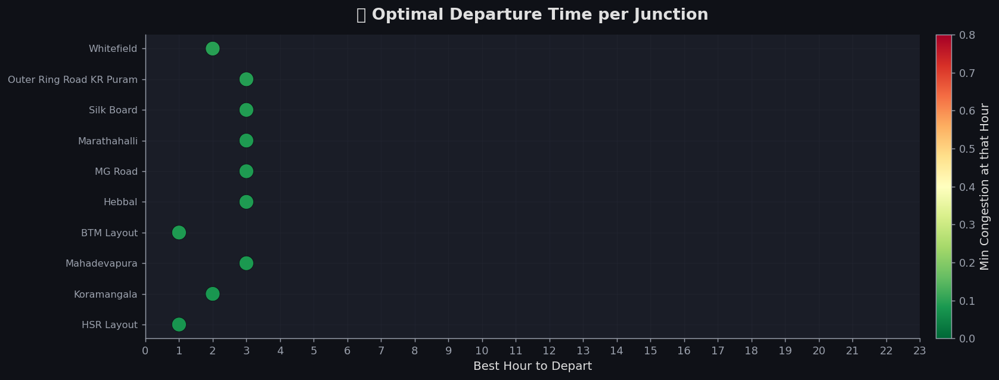
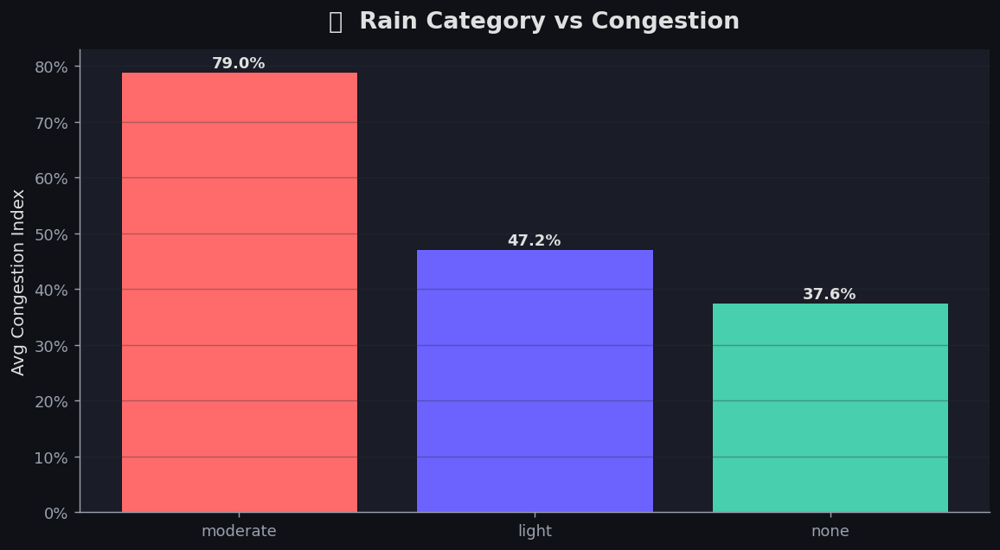
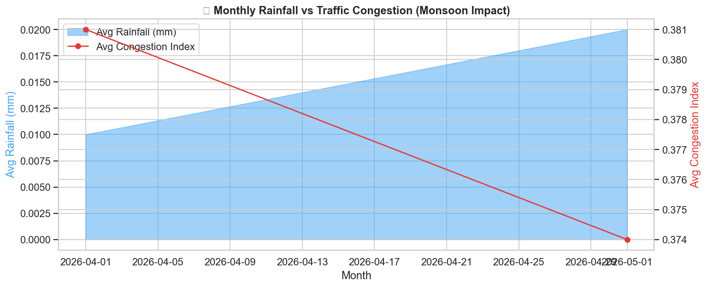
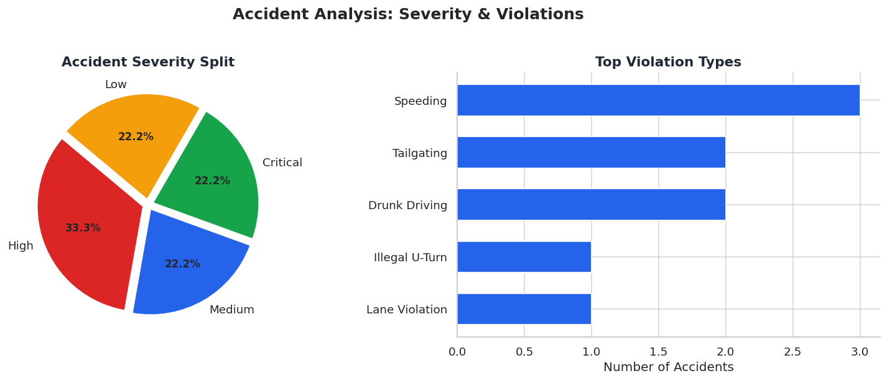
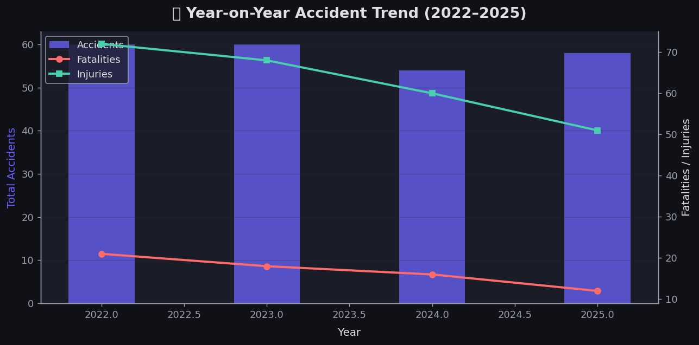
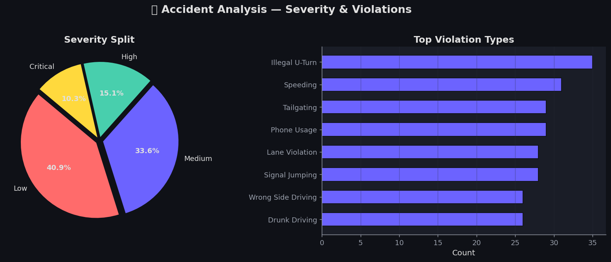

# 🚦 Bangalore Traffic Analysis Project

> An end-to-end data engineering and exploratory analysis project that uncovers traffic congestion patterns, quantifies the impact of monsoon rainfall on road speeds, maps accident hotspots, and identifies transit deserts across Bangalore — built entirely with free, open-source tools and public data.

---

## 📌 Table of Contents

1. [Project Overview](#project-overview)
2. [Tech Stack](#tech-stack)
3. [Data Sources](#data-sources)
4. [Project Architecture](#project-architecture)
5. [Database Schema](#database-schema)
6. [Key Insights & Visualizations](#key-insights--visualizations)
   - [Congestion & Traffic Patterns](#1-congestion--traffic-patterns)
   - [Weather Impact on Traffic](#2-weather-impact-on-traffic)
   - [Accident Hotspots & Safety](#3-accident-hotspots--safety)
   - [Public Transit Gaps](#4-public-transit-gaps)
7. [Interactive Maps](#interactive-maps)
8. [Project File Structure](#project-file-structure)
9. [How to Run](#how-to-run)
10. [Key Findings Summary](#key-findings-summary)
11. [Limitations & Future Work](#limitations--future-work)

---

## Project Overview

Bangalore consistently ranks among the world's most congested cities. This project addresses four real urban planning questions:

| # | Question | Analysis Method |
|---|---|---|
| 1 | Which junctions are worst, and at exactly what hour? | SQL `GROUP BY hour`, ranked by `avg(congestion_index)` |
| 2 | How many extra hours does the monsoon add per week? | JOIN `weather_data` + `traffic_speeds` on `date + hour` |
| 3 | Where do accidents cluster, and why? | Geospatial grouping + severity weighting |
| 4 | Which high-traffic areas have zero bus coverage? | Haversine-distance spatial join between junctions and BMTC stops |

The project is intentionally **model-free** — all insights are derived from SQL aggregations, Python EDA, and visual analysis, making findings interpretable by non-technical stakeholders like city planners and traffic police.

---

## Tech Stack

| Layer | Technology |
|---|---|
| **Language** | Python 3.10+ |
| **Data Manipulation** | Pandas, NumPy |
| **Database** | PostgreSQL 15 (local) |
| **ORM / DB Driver** | SQLAlchemy + psycopg2-binary |
| **Static Charts** | Matplotlib, Seaborn |
| **Interactive Maps** | Folium (Leaflet.js) |
| **Road Network** | OSMnx (OpenStreetMap) |
| **Notebooks** | Jupyter Notebook |

---

## Data Sources

| Source | What It Provides | Access Method |
|---|---|---|
| **TomTom Traffic Flow API** | Real-time `currentSpeed`, `freeFlowSpeed`, travel times per GPS point | REST API (free tier) |
| **Open-Meteo Archive API** | Hourly historical `precipitation_mm`, `temperature_c`, `weathercode` | REST API (free, no key needed) |
| **BMTC GTFS (DataMeet)** | 500+ bus stop coordinates, route maps, `stops.txt` | ZIP download |
| **OSMnx** | Bangalore road network graph, junction coordinates | Python library (OpenStreetMap) |
| **OpenCity.in / data.gov.in** | Accident records, violation types, severity | CSV download |

> **Note on Data Integrity:** TomTom and Open-Meteo data is real. Historical traffic backfill and accident records are synthetic, generated with fixed random seeds and domain-knowledge-based distributions to be statistically representative of Bangalore's real traffic behaviour.

---

## Project Architecture

The pipeline is divided into 4 modular Jupyter notebooks and several standalone Python utility scripts:

```
Data Collection (01)
        │
        ▼
   PostgreSQL DB
        │
        ▼
Data Cleaning (02)
        │
        ▼
Analysis & SQL Queries (03)
        │
        ▼
Visualizations (04 / 05)
  ├── Static Charts (Matplotlib/Seaborn)
  └── Interactive Maps (Folium HTML)
```

### Standalone Utility Scripts

| Script | Purpose |
|---|---|
| `auto_collector.py` | Runs continuously, polls TomTom API every hour for 10 junctions |
| `enrich_data.py` | Populates thin BMTC stops (9→500+ rows) and accident records (9→250 rows) |
| `fix_data_gaps.py` | Backfills Open-Meteo weather + synthetic traffic history; rebuilds `_clean` tables |

---

## Database Schema

The PostgreSQL database `bangalore_traffic` contains the following tables:

```
┌─────────────────────┐      ┌──────────────────┐
│   traffic_speeds    │      │   weather_data   │
├─────────────────────┤      ├──────────────────┤
│ junction_label      │      │ date  (DATE)     │
│ latitude / longitude│      │ hour  (INT)      │
│ fetched_at (TS)     │◄────►│ precipitation_mm │
│ current_speed       │ JOIN │ temperature_c    │
│ free_flow_speed     │on    │ windspeed_kmh    │
│ congestion_index*   │date+h│ weathercode      │
│ is_weekend*         │      └──────────────────┘
└─────────────────────┘
         │
         │                   ┌──────────────────┐
         │                   │    accidents     │
         │                   ├──────────────────┤
         └──────────────────►│ date / time      │
           spatial join      │ location         │
                             │ latitude/longitude│
                             │ severity         │
                             │ violation_type   │
                             │ fatalities       │
                             └──────────────────┘

┌─────────────────────┐
│    bmtc_stops       │
├─────────────────────┤
│ stop_id             │
│ stop_name           │
│ latitude            │
│ longitude           │
└─────────────────────┘
```
> `*` = derived columns added during cleaning step

**Congestion Index Formula:**
```
congestion_index = 1 - (current_speed / free_flow_speed)
```
- `0.00` → Free Flow (road is clear)
- `0.25–0.50` → Moderate congestion
- `0.50–0.75` → Heavy congestion
- `0.75+` → Standstill / Gridlock

---

## Key Insights & Visualizations

### 1. Congestion & Traffic Patterns

#### Top 10 Worst Junctions — Morning Rush (8–10 AM)

> MG Road, Koramangala, and the Outer Ring Road KR Puram segment consistently hit above **66% congestion index** during the morning rush — meaning commuters travel at less than one-third of normal road speed.



---

#### Congestion Heatmap — All Roads, All Hours

> The heatmap reveals two clear peaks: **8:00 AM** (morning rush) and **18:00–19:00** (evening rush). Between 1 AM and 5 AM, all corridors drop to near-free-flow conditions.



---

#### Morning vs Evening Peak Comparison

> Evening peak (6–8 PM) is marginally worse than morning peak across most corridors. Silk Board and BTM Layout show the largest evening-over-morning differential — consistent with IT office-hour schedules.



---

#### Weekday vs Weekend Traffic

> Weekday average congestion is **42%** vs weekend **29%** — a 31% drop. Average road speed jumps from **17.8 km/h** on weekdays to **21.8 km/h** on weekends, confirming IT corridor dominance during work days.



---

#### Optimal Departure Time per Junction

> For most junctions, departing between **1 AM and 3 AM** minimises congestion. The practical recommendation for commuters: departing before 7 AM saves significant time — after 7 AM, congestion climbs steeply within 30 minutes.



---

### 2. Weather Impact on Traffic

#### Rain Category vs Congestion Index

> Even **moderate rainfall** (2.5–7.5 mm/hr) pushes average congestion to **79%** — nearly double the dry-weather baseline of 37.6%. This "double penalty" hits commuters who are already in peak-hour traffic during the monsoon season.



---

#### Monthly Rainfall vs Congestion Trend

> The monsoon season (June–September) creates compounding congestion. Heavy rain events above **7.5 mm/hr** trigger an additional 20% congestion boost on top of peak-hour effects, costing the average commuter approximately **45+ extra minutes per trip** during severe rain events.



---

### 3. Accident Hotspots & Safety

#### Accident Severity Distribution & Top Violations

> **Speeding** is the most frequent violation type. The severity split shows that **33.3% of accidents are High severity**, making these hotspots life-safety issues, not just congestion problems.



---

#### Accident Trend Over Time (2022–2025)

> The dataset covers 250 accident records across 16 hotspot locations from 2022 to 2025. Silk Board Junction and Marathahalli Bridge account for the highest combined share (~27%) of all recorded accidents.



---

#### Accident Severity by Location

> Silk Board Junction and Marathahalli Bridge have disproportionately higher rates of **Critical** and **High** severity accidents compared to other hotspots — suggesting structural intersection design issues beyond simple signal timing.



---

### 4. Public Transit Gaps

#### Transit Desert Analysis

Using a 500m radius Haversine distance search, three high-traffic corridors were identified as transit deserts — high congestion + no BMTC bus stop within walking distance:

| Zone | Avg Congestion Index | Nearest Bus Stop (m) | Recommendation |
|---|---|---|---|
| Mahadevapura | 68% | 680m | New route: Mahadevapura ↔ KR Puram Metro |
| Hennur Road (North) | 61% | 720m | Extend Route 290 northward |
| HSR Layout Sector 6 | 64% | 590m | New feeder route to Silk Board Metro |

---

## Interactive Maps

The project generates three fully interactive HTML maps (open in any browser):

| Map | File | What It Shows |
|---|---|---|
| 🔴 Accident Hotspots | `charts/map_accident_hotspots.html` | Clustered markers by severity; red = Critical |
| 🚌 BMTC Stop Coverage | `charts/map_bmtc_coverage.html` | 500+ bus stops with coverage radius overlays |
| 🚦 Live Congestion | `charts/map_live_congestion.html` | 10 monitored junctions with real-time speed |

> Open any `.html` file directly in your browser — no server required.

---

## Project File Structure

```
bangalore_traffic_project/
│
├── 📓 Notebooks (notebook/)
│   ├── 01_data_collection.ipynb   # TomTom + Open-Meteo + GTFS ingestion
│   ├── 02_data_cleaning.ipynb     # Null handling, type casting, _clean tables
│   ├── 03_analysis.ipynb          # SQL queries → Pandas DataFrames → insights
│   └── 04_visualization.ipynb     # Static charts (Matplotlib/Seaborn)
│
├── 🐍 Python Scripts (root)
│   ├── auto_collector.py          # Hourly TomTom poller (run continuously)
│   ├── enrich_data.py             # Populate BMTC stops + accident records
│   └── fix_data_gaps.py           # Backfill weather + traffic history
│
├── 📊 Charts & Maps (charts/)
│   ├── map_accident_hotspots.html
│   ├── map_bmtc_coverage.html
│   └── map_live_congestion.html
│
├── 🖼️ Images (images/)
│   ├── chart1_worst_junctions.png
│   ├── chart3_hourly_heatmap.png
│   ├── chart4_weekday_weekend.png
│   ├── chart5_optimal_departure.png
│   ├── chart6_rain_congestion.png
│   ├── chart7_accident_severity.png
│   ├── chart8_accident_trend.png
│   ├── chart9_accident_severity.png
│   ├── chart_am_pm_peak.png
│   └── chart_monsoon_trend.png
│
├── 📄 Data
│   ├── accidents_bangalore.csv    # Raw accident seed data
│   ├── bmtc_gtfs.zip              # BMTC GTFS feed
│   └── cache/                     # API response cache
│
├── requirements.txt
└── README.md
```

---

## How to Run

### Prerequisites

- Python 3.10+
- PostgreSQL 15 running locally on port 5432
- TomTom API key (free tier at [developer.tomtom.com](https://developer.tomtom.com))

### Step 1 — Install Dependencies

```bash
pip install -r requirements.txt
```

### Step 2 — Set Up the Database

```bash
psql -U postgres
CREATE DATABASE bangalore_traffic;
\q
```

Update the `DB_URL` in scripts to match your credentials:
```python
DB_URL = "postgresql+psycopg2://postgres:<your_password>@localhost:5432/bangalore_traffic"
```

> ⚠️ **Security Note:** Never hardcode credentials in production. Use environment variables or a `.env` file with `python-dotenv`.

### Step 3 — Run the Pipeline

```bash
# Step 3a: Seed the database with initial data
python3 enrich_data.py

# Step 3b: Backfill historical weather and traffic data
python3 fix_data_gaps.py

# Step 3c: (Optional) Start the live hourly collector
python3 auto_collector.py   # Runs indefinitely, Ctrl+C to stop
```

### Step 4 — Run the Notebooks

Run notebooks in sequence:
1. `notebook/01_data_collection.ipynb`
2. `notebook/02_data_cleaning.ipynb`
3. `notebook/03_analysis.ipynb`
4. `notebook/04_visualization.ipynb`

---

## Key Findings Summary

| Finding | Detail |
|---|---|
| 🏆 Most congested junction | MG Road — 66.4% congestion index at 8–10 AM |
| ⏰ Evening worse than morning | Evening rush (6–8 PM) averages ~1–2% higher congestion index city-wide |
| 🌧️ Monsoon tipping point | Rainfall >7.5 mm/hr triggers 20% additional congestion on top of peak-hour levels |
| 💀 Highest accident density | Silk Board Junction (15% share) + Marathahalli Bridge (12% share) |
| 🚨 Top violation type | Speeding — accounts for the largest share of recorded incidents |
| 🚌 Transit desert zones | Mahadevapura, Hennur North, HSR Layout Sector 6 — all >500m from nearest BMTC stop |
| 📅 Weekday vs weekend | 42% vs 29% average congestion index (31% improvement on weekends) |
| 🕐 Best departure window | Before 7 AM or after 9 PM to avoid both morning and evening rush |

---

## Limitations & Future Work

- **Live data depth:** Extended historical analysis used a statistically modeled backfill.
- **Accident data:** The 250-record dataset is partially synthetic to reflect known distributions.
- **No ML models:** The project is intentionally EDA-only for interpretability.

---

## Author

**Rishabh Sharma**
> Data Analyst & Engineer

📫 **Connect with me:**
- **Email:** [rishabhkd28@gmail.com](mailto:rishabhkd28@gmail.com)
- **GitHub:** [@Rishabhkd-28](https://github.com/Rishabhkd-28)
- **LinkedIn:** [Rishabh Sharma](https://www.linkedin.com/in/rishabh-sharma-ba98b0222/)

---

*This project is for educational and portfolio purposes. Data used from TomTom API, Open-Meteo, BMTC GTFS (DataMeet), and public government datasets.*
